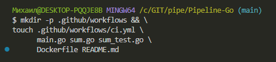
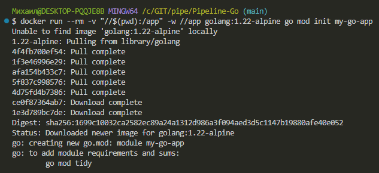
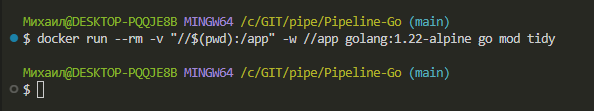
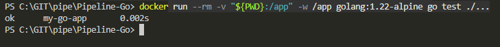
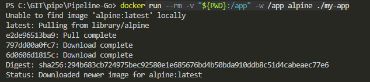

# Pipeline-Go
# Pipeline CI на Go в GitHub Actions
### Цель — учебный пример — простой проект, который можно склонировать, настроить и убедиться, что приложение в контейнере на Go, и GitHub Actions работает

### Вы научитесь:

- Настроить CI для Go проектов
- Научиться контейнеризировать приложения с Docker
- Сборку Docker-образа
- Сохранение артефактов для локального использования
Go (Golang) — это компилируемый, многопоточный язык программирования от Google с открытым исходным кодом, созданный для разработки высокопроизводительных веб-сервисов, микросервисов и облачных инфраструктур. Он сочетает синтаксис, похожий на C, с простотой, высокой скоростью выполнения

# 1. Создайте на GitHub новый публичный репозиторий my-go-app с README.md
Склонируйте его себе, откройте в VS Code и создайте такую структуру будущего проекта:

Структура проекта
```
my-go-app/
├── .github/
│   └── workflows/
│       └── ci.yml
├── main.go
├── sum.go
├── sum_test.go
├── Dockerfile
└── README.md
```
Структуру проекта можно сделать одной bash-командой, которая автоматически создаст все файлы и каталоги проекта:
```
mkdir -p .github/workflows && \
touch .github/workflows/ci.yml \
      main.go sum.go sum_test.go \
      Dockerfile README.md
```



# 2. Инициализация Go-модуля
т.к. Go в вашей ОС скорей всего не установлен

### Windows/PowerShell (надо проверять)

            docker run --rm -v "${PWD}:/app" -w /app golang:1.22-alpine go mod init my-go-app

### Любой Unix

            docker run --rm -v "$(pwd):/app" -w /app golang:1.22-alpine go mod init my-go-app

## Инициализация модуля go mod для удовлетворения зависимостей

### Windows/PowerShell (надо проверять)

            docker run --rm -v "${PWD}:/app" -w /app golang:1.22-alpine go mod tidy

### Любой Unix

            docker run --rm -v "$(pwd):/app" -w /app golang:1.22-alpine go mod tidy






## 3. Запуск локальных Тестов

чтобы убедиться, что код приложения работает

### Windows/PowerShell (надо проверять)

            docker run --rm -v "${PWD}:/app" -w /app golang:1.22-alpine go test ./...



## 4. Сборка бинарного файла локально
Windows/PowerShell (надо проверять)

            docker run --rm -v "${PWD}:/app" -w /app golang:1.22-alpine go build -o my-app .

